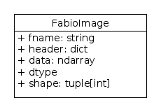
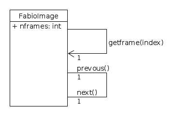
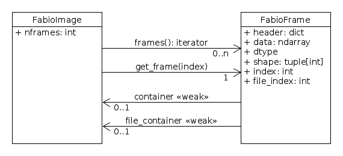

Getting Started
===============

FabIO is a Python module for reading and handling data from two-dimensional X-ray
detectors.

FabIO is a Python module written for easy and transparent reading
of raw two-dimensional data from various X-ray detectors. The
module provides a function for reading any image and returning a
:class:`FabioImage` object which contains both metadata (header information)
and the raw data. All `FabioImage` object offer additional methods to
extract information about the image and to open other detector
images from the same data series.

Introduction
------------

One obstacle when writing software to analyse data collected from a
two-dimensional detector is to read the raw data into the program,
not least because the data can be stored in many different formats
depending on the instrument used. To overcome this problem we
decided to develop a general module, FabIO (FABle I/O), to handle
reading and writing of two-dimensional data. The code-base was
initiated by merging parts of our fabian imageviewer and
ImageD11 peak-search programs and has been developed
since 2007 as part of the TotalCryst program suite for
analysis of 3DXRD microscopy data. During integration into
a range of scientific programs like the FABLE graphical interface,
EDNA and the fast azimuthal integration library,
pyFAI; FabIO has gained several features like handling
multi-frame image formats as well as writing many of the file
formats.

FabIO Python module
-------------------

Python is a scripting language that is very popular among
scientists and which also allows well structured applications and
libraries to be developed.

Philosophy
..........

The intention behind this development was to create a Python module
which would enable easy reading of 2D data images, from any
detector without having to worry about the file format. Therefore
FabIO just needs a file name to open a file and it determines the
file format automatically and deals with gzip and bzip2
compression transparently. Opening a file returns an object
which stores the image in memory as a 2D NumPy array
and the metadata, called header, in a Python dictionary.
Beside the data and header attributes, some methods are
provided for reading the previous or next image in a series of
images as well as jumping to a specific file number. For the user,
these auxiliary methods are intended to be independent of the image
format (as far as is reasonably possible).

FabIO is written in an object-oriented style (with classes) but
aims at being used in a scripting environment: special care has
been taken to ensure the library remains easy to use. Therefore no
knowledge of object-oriented programming is required to get full
benefits of the library. As the development is done in a
collaborative and decentralized way; a comprehensive test suite has
been added to reduce the number of regressions when new features
are added or old problems are repaired. The software is very
modular and allows new classes to be added for handling other data
formats easily. FabIO and its source-code are freely available to
everyone on-line, licensed under the liberal MIT License. 
FabIO is also available directly from
popular Linux distributions like Debian and Ubuntu.

Implementation
..............

The main language used in the development of FabIO is Python;
however, some image formats are compressed and require
compression algorithms for reading and writing data. When such
algorithms could not be implemented efficiently using Python or
NumPy native modules were developed, in i.e. standard C code
callable from Python (sometimes generated using Cython).
This code has to be compiled for each computer architecture and
offers excellent performance. FabIO is only dependent on the NumPy
module and has extra features if two other optional Python modules
are available. For reading XML files (that are used in EDNA) the
lxml module is required and the Python Image Library, `PIL`
is needed for producing a PIL image for displaying the image
in graphical user interfaces and several image-processing
operations that are not re-implemented in FabIO. A variety of
useful image processing is also available in the `scipy.ndimage`
module and in `scikits-image`.

Images can also be displayed in a convenient interactive manner
using `matplotlib` and an `IPython` shell , which
is mainly used for developing data analysis algorithms. Reading and
writing procedure of the various TIFF formats is based on the
TiffIO code from PyMCA.

In the Python shell, the `fabio` module must be imported prior to
reading an image in one of the supported file formats (see Table
`Supported formats`, hereafter).
The `fabio.open` function creates an instance of the
Python class `fabioimage`, from the name of a file. This instance,
named `img` hereafter, stores the image data in `img.data` as a 2D
NumPy array. Often the image file contains more information than
just the intensities of the pixels, e.g. information about how the
image is stored and the instrument parameters at the time of the
image acquisition, these metadata are usually stored in the file
header. Header information, are available in `img.header` as a
Python dictionary where keys are strings and values are usually
strings or numeric values.

Information in the header about the binary part of the image
(compression, endianness, shape) are interpreted however, other
metadata are exposed as they are recorded in the file. FabIO allows
the user to modify and, where possible, to save this information
(the table `Supported formats` summarizes writable formats).
Automatic translation
between file-formats, even if desirable, is sometimes impossible
because not all format have the capability to be extended with
additional metadata. Nevertheless FabIO is capable of converting
one image data-format into another by taking care of the numerical
specifics: for example float arrays are converted to integer arrays
if the output format only accepts integers.

FabIO methods
.............
One strength of the implementation in an object oriented language
is the possibility to combine functions (or methods) together with
data appropriate for specific formats.

In addition to the :attr:`~fabio.fabioimage.FabioImage.header` information and
image :attr:`~fabio.fabioimage.FabioImage.data`,
every :class:`~fabio.fabioimage.FabioImage` instance (returned
by :py:func:`fabio.open`) has methods inherited from :class:`~fabio.fabioimage.FabioImage` which
provide information about the image minimum, maximum and mean
values.

.. code-block:: python

   import fabio
   image = fabio.open('image.tif')
   print(image.header)       # print the header
   print(image.data.mean())  # print mean intensity of the data
   image.close()

FabIO old-fashion file series
.............................

Multi-frames for certain file formats are handled using file series.

A set of methodes, specific for certain formats provide access to the data
through a series of files. These methods are :meth:`~fabio.fabioimage.FabioImage.next`,
:meth:`~fabio.fabioimage.FabioImage.previous`, and :meth:`~fabio.fabioimage.FabioImage.getframe`.
The behaviour of such methods varies depending on the image format: for single-frame
format (like mar345), :meth:`~fabio.fabioimage.FabioImage.next` will return the image in next
file; for multi-frame format (like GE), :meth:`~fabio.fabioimage.FabioImage.next` will return
the next frame within the same file. 
For formats which are possibly multi-framed like EDF and TIFF, the behaviour can be complicated 
and depend on the actual number of frames per file 
(accessible via the :attr:`~fabio.fabioimage.FabioImage.nframes` attribute).

.. code-block:: python

    import fabio
    im1 = fabio.open("200mMmgso4_001.mar2300")   # Open image file
    print(im1.data[1024,1024])                   # Check a pixel value
    im2 = im1.next()                             # Open next image
    print(im2.filename)                          # prints 200mMmgso4_002.mar2300                     
    im5 = im1.getframe(5)                        # Jump to file number 5: 200mMmgso4_005.mar2300

The files used in this example are available from https://zenodo.org/record/2546760#.Y5H1n0jMLmE

This conveniant way to iterate through many files has limitations. It is not
working in case of many frames per files (TIF), the read access is difficult to
optimize, and it is difficult to custom the list of files.

FabIO file series
.................

This design introduces a real :class:`~fabio.fabioimage.FabioFrame` as composition
of all :class:`~fabio.fabioimage.FabioImage`.

For single frames images, :class:`~fabio.fabioimage.FabioImage` still provides
access to the data of to the first (and only one) frame. But the method :meth:`~fabio.fabioimage.FabioImage.get_frame`
(with an underscore, not :meth:`~fabio.fabioimage.FabioImage.getframe`) provides access to any frames contained in the file.
A file containing a single data, also contains a single frame object. Both provide the same data
(there is 2 ways to access to this data).

To iterate other many files a :class:`~fabio.file_series.FileSeries` can be used.
This object is a :class:`~fabio.fabioimage.FabioImage` which a set of file as a single container of frame.
The hi-level function :func:`~fabio.open_series` is provided to hide the complexity.

This function (or this class) allows different ways to custom the file iteration.
Plus optional informnation to describe the way frames as stored in files in order
to optimize the random access.

Methodes provided allow to reach frames
using a sequencial access (:meth:`~fabio.fabioimage.FabioImage.frames`)
or using a random access (:meth:`~fabio.fabioimage.FabioImage.get_frame`).

.. code-block:: python

    # Random access
    import fabio
    # The first filename of consecutive filenames while foobar_xxxx.edf exists
    filename = "foobar_0000.edf"
    with fabio.open_series(first_filename=filename) as series:
        frame1 = series.get_frame(1)
        frame100 = series.get_frame(100)
        frame19 = series.get_frame(19)

Usually, in case of a random access only accessed data have to be decoded, but the file
have to be fully read to index the frames (depending of the codec, then the file
format).

In case of huge EDF file series a sequencial access to the frames speed up by
2 the reading time.

.. code-block:: python

    # Sequencial access
    import fabio
    # The first filename of consecutive filenames while foobar_xxxx.edf exists
    filename = "foobar_0000.edf"
    with fabio.open_series(first_filename=filename) as series:
        for frame in series.frames():
            frame.data
            frame.header
            frame.index                    # frame index inside the file series
            frame.file_index               # frame index inside the edf file
            frame.file_container.filename  # name of the source file

Examples
--------

Normalising the intensity to a value in the header
..................................................

.. code-block:: python

    img = fabio.open('exampleimage0001.edf')
    print(img.header)
    {'ByteOrder': 'LowByteFirst',
     'DATE (scan begin)': 'Mon Jun 28 21:22:16 2010',
     'ESRFCurrent': '198.099',
     ...
    }
    # Normalise to beam current and save data
    srcur = float(img.header['ESRFCurrent'])
    img.data *= 200.0/srcur
    img.write('normed_0001.edf')

Interactive viewing with matplotlib
...................................

.. code-block:: python

    from matplotlib import pyplot       # Load matplotlib
    pyplot.imshow(img.data)             # Display as an image
    pyplot.show()                       # Show GUI window

Converting a TIFF to an EDF
...........................

.. code-block:: python

   import fabio
   image = fabio.open("my.tiff")
   image.convert("edf").save("my.edf")

Future and perspectives
-----------------------

The Hierarchical Data Format version 5 (`hdf5`) is a data format which
is increasingly popular for storage of X-ray and neutron data. To
name a few facilities the synchrotron Soleil and the neutron
sources ISIS, SNS and SINQ already use HDF extensively through the
NeXus format. For now, mainly processed or curated data are
stored in this format but new detectors (Eiger from Dectris) are natively
saving data in HDF5. FabIO will rely on H5Py, which
already provides a good HDF5 binding for Python, as an external
dependency, to be able to read and write such HDF5 files.
This starts to be available in version 0.4.0.

Conclusion
----------

FabIO gives an easy way to read and write 2D images when using the
Python computer language. It was originally developed for X-ray
diffraction data but now gives an easy way for scientists to access
and manipulate their data from a wide range of 2D X-ray detectors.
We welcome contributions to further improve the code and hope to
add more file formats in the future.

Acknowledgements
................

We acknowledge Andy Götz and Kenneth Evans for extensive
testing when including the FabIO reader in the Fable image viewer
(Götz et al., 2007).
We also thank V. Armando Solé for assistance with
his TiffIO reader and Carsten Gundlach for deployment of FabIO at
the beamlines i711 and i811, MAX IV, and providing bug reports. 
We finally acknowledge our colleagues who have reported bugs and
helped to improve FabIO. Financial support was granted by the EU
6th Framework NEST/ADVENTURE project TotalCryst (Poulsen et al., 2006).

Citation
........

Knudsen, E. B., Sørensen, H. O., Wright, J. P., Goret, G. & Kieffer, J. (2013). J. Appl. Cryst. 46, 537-539.

http://dx.doi.org/10.1107/S0021889813000150

List of file formats that FabIO can read and write
..................................................

In alphabetical order. The listed filename extensions are typical examples.
FabIO tries to deduce the actual format from the file itself and only
uses extensions as a fallback if that fails.

.. csv-table:: Supported formats
   :header: "Python Module", "Detector / Format", "Extension", "Read", "Multi-image", "Write"
   :widths: 30, 30, 20, 10, 15, 10

   "ADSC", "ADSC Quantum", ".img", "Yes", "No", "Yes"
   "Bruker86", "Bruker formats", ".sfrm ", "Yes", "No", "Yes"
   "Bruker100", "Bruker formats", ".sfrm ", "Yes", "No", "Yes"
   "CBF", "CIF binary files", ".cbf ", "Yes", "No", "Yes"
   "DM3", "Gatan Digital Micrograph ", ".dm3 ", "Yes", "No", "No"
   "EDF", "ESRF data format ", ".edf ", "Yes", "Yes ", "Yes"
   "EDNA-XML", "Used by EDNA", ".xml ", "Yes", "No", "No"
   "Eiger", "Dectris format", ".h5", "Yes", "Yes", "Yes"
   "Fit2D", "Fit2D binary format", ".f2d", "Yes", "No", "No"
   "Fit2D mask", "Fit2D mask", ".msk ", "Yes", "No", "Yes"
   "Fit2D spreadsheet", "Fit2D Ascii format", ".spr ", "Yes", "No", "Yes"
   "GE", "General Electric", "", "Yes", "Yes ", "No"
   "JPEG", "Joint Photographic Experts Group", ".jpg", "Yes", "No", "No"
   "JPEG2k", "JPEG 2000", ".jpx", "Yes", "No", "No"
   "Hdf5", "Needs the dataset path", ".h5", "Yes", "Yes", "No"
   "HiPiC", "Hamamatsu CCD", ".tif ", "Yes", "No", "No"
   "kcd", "Nonius KappaCCD", ".kccd ", "Yes", "No", "No"
   "marccd", "MarCCD/Mar165", ".mccd ", "Yes", "No", "No"
   "mar345", "Mar345 image plate", ".mar3450 ", "Yes", "No", "Yes"
   "mpa", "Multi-wire detector", ".mpa", "yes", "No", "No"
   "mrc", "Medical Research Council", ".map", "Yes", "Yes", "No"
   "numpy", "numpy 2D array", ".npy ", "Yes", "No", "Yes"
   "OXD", "Oxford Diffraction", ".img ", "Yes", "No", "Yes"
   "Pixi", "pixi", "", "Yes", "No", "No"
   "pilatus", "Dectris Pilatus Tiff", ".tif ", "Yes", "No", "Yes"
   "PNM", "Portable aNy Map", ".pnm ", "Yes", "No", "Yes"
   "Raxis", "Rigaku Saxs format", ".img", "Yes", "No", "No"
   "spe", "Princeton instrumentation", ".spe", "Yes", "Yes", "No"
   "TIFF", "Tagged Image File Format", ".tif", "Yes", "Yes", "Yes"
   "Xcalibur", "mask format used by CrysalisPro", ".ccd", "Yes", "No", "Yes" 

Adding new file formats
.......................

We hope it will be relatively easy to add new file formats to FabIO in the future.
Please refere at the *fabio/templateimage.py* file in the source which describes
how to add a new format.

